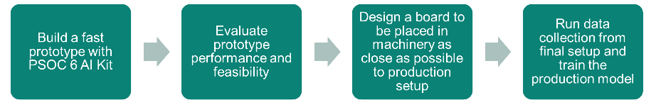
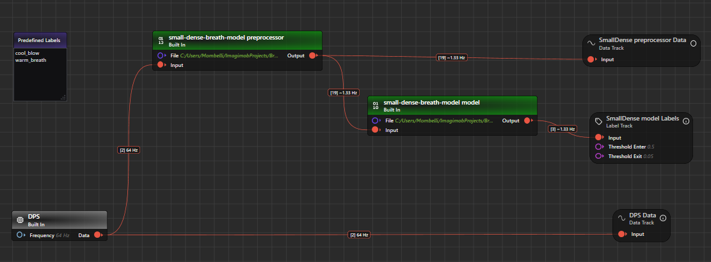
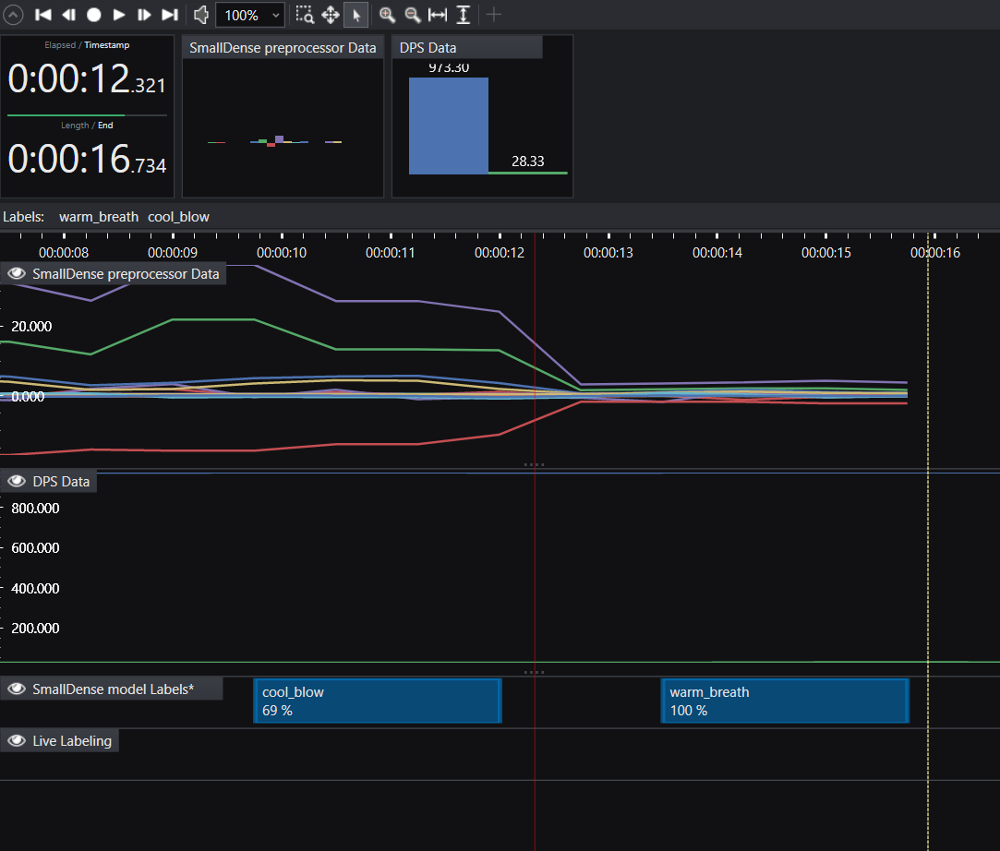

# Human Breath Detection (using XENSIV™ digital barometric air pressure sensor)

This project is designed to work exclusively with DEEPCRAFT™ Studio. Download it from [here](https://softwaretools.infineon.com/assets/com.ifx.tb.tool.deepcraftstudio)

## Use-case description

This Accelerator demonstrates an AI model that classifies three states based solely on air-pressure and temperature dynamics at the sensor: cool_blow, warm_breath, and none. By learning the characteristic signatures of fast, focused airflow versus slow, warm exhalation, the model provides robust, on-device inference without external instrumentation, highlighting the precision and sensitivity of the XENSIV digital barometric pressure sensor (DPS) integrated with PSoC 6.

This Accelerator uses a XENSIV™ digital barometric air pressure sensor for breath-type differentiation. The goal is twofold: showcase the sensor’s capability to separate subtle human airflow modalities using only pressure and temperature, and inspire customers to envision practical applications where low-power, embedded ML can add real-time context awareness to compact devices.

### Value and potential applications

Demonstration of sensor fidelity: This model underscores how the XENSIV DPS can resolve small, transient pressure deltas along with subtle temperature changes, enabling reliable classification of human airflow type on a resource-constrained microcontroller.
Human–device interaction: Natural, contactless triggers (e.g., blowing versus breathing) can augment user interfaces for toys, educational devices, or accessibility aids.
Situational awareness: In concept, multiple nodes could monitor breathing presence or type in constrained scenarios. For example, in mass-casualty incidents with limited personnel, an adapted version of this model could assist responders by flagging patients who appear to be exhaling versus showing no breath signal, helping prioritize attention.
Important note: This is not a medical device and is not intended for diagnosis or life-critical monitoring. Any emergency-use concept requires rigorous validation, certification, and safeguards before deployment.

### Operating instructions and tips

Orientation: Ensure the sensor port is unobstructed and facing the user; avoid covering it with (warm) fingers.
Environment: Minimize background airflow (fans, HVAC vents, outdoor wind) and strictly avoid direct exposure to sunlight (it will heat up the sensor, causing wrong results).
Ensure sufficient cooling! The sensor heats up after prolonged use; cool it regularly, e.g. with a paper fan.

### How to perform cool_blow (pursed lips)

Hold the device so the pressure/temperature sensor opening faces you.
Keep a distance of approximately 2–7 cm.
Purse your lips as if to whistle and blow cold(!) and steadily onto the sensor for a few seconds.
Avoid spitting; a strong, focused airstream is sufficient.

### How to perform warm_breath (open mouth)

Maintain the same 2–7 cm distance.
Open your mouth and gently breathe out onto the sensor for a few seconds, as if fogging a window or warming your hands. It should be a slower, warm exhale.
Do not blow forcefully.

## Contents

`Data` — Folder to put your data.

`Models` — Folder where trained models, their predictions, and generated Edge code are saved.

`Tools` — Folder containing GraphUX utility projects: `Tools/LiveDataCollection` for live data collection (see [README](Tools/LiveDataCollection/README.md)) and `Tools/LiveModelEvaluation` for model evaluation.

### Sensor settings specification

This Accelerator requires the [PSOC™ 6 AI Evaluation Kit](https://www.infineon.com/cms/en/product/evaluation-boards/cy8ckit-062s2-ai/). This platform is (among other things) equipped with the XENSIV™ digital barometric air pressure sensor. The board is designed for easy prototyping and lets you collect real-life data to build a compelling ML product quickly.
Apart from the PSoC 6 AI Evaluation Kit, you do not need any additional hardware.

## Collecting and expanding the dataset

### Live data collection

To record additional training data, follow the instructions in [Tools/LiveDataCollection/README.md](Tools/LiveDataCollection/README.md).

### Provided sample data (`Data` folder)

The `Data` folder contains a large number of pre-recorded samples, primarily grouped by day and location, as each group reflects slight differences in daily temperature and air pressure.

### Sample naming

Some samples are named after the recording date only. For more information about labels, open the `.imsession` or `.label` file. All other files follow this scheme: `LABEL_PROXIMITY_DURATION_WAIT_TIME_PRESSURE_NUMBER`, for example: `xxx(_xxx)_N_N_xxx_N`.

### General suggestions

- Place each dataset/recording in its own folder, including label files, videos of data collection, metadata, and so on.
- Use the same filename in each folder for the data file, e.g. `data.data`, `data.wav`, etc.
- Group folders with data from the same class or characteristic. For example, `person1` contains folders `gestures1`, `gestures2`, etc., and each gesture folder contains folders with the actual data.

## A note on data labeling / model output

Note that DEEPCRAFT™ Studio introduces an "Unlabelled data" class by default.

**cool_blow**: Indicates a fast, focused airstream typically associated with pursed lips; often characterized by a distinct pressure pulse with limited warming of the sensor.
**warm_breath**: Indicates a slower exhalation typical of open-mouth breathing; often characterized by a gentler pressure change and a temperature increase at the sensor.
**Unlabelled**: Indicates no significant airflow or temperature change consistent with breath-related events.

## Recommended path to production

To bring this Accelerator to a production-level system, follow these general steps:

The prototyping phase is fundamental because it lets you assess feasibility quickly and at low cost. If you can reach satisfactory performance with a simple prototype, you can be confident about achieving good results in production.

1. Define your target setup and real-world usage

Decide how the sensor will be used in the final device (distance to the user, enclosure/air path, orientation, typical ambient airflow and temperature).
Try to keep these conditions consistent during prototyping; even small changes can shift pressure/temperature dynamics.

2. Collect (or reuse) representative data

Use the provided template data as a baseline and record your own data in your intended environment to validate performance. See [Tools/LiveDataCollection/README.md](Tools/LiveDataCollection/README.md) for the live data collection workflow.
Ensure all three classes are covered with enough variation (different users, multiple sessions, slightly different distances).

3. Import your data and train the prototype model

Import the data you collected in the "Data" tab of the .improj file in DEEPCRAFT™ Studio.
You can then follow the standard DEEPCRAFT™ Studio steps for processing, training, and deploying your model.
The preprocessor is already set, and some models are already defined for you, whose performance is guaranteed to be in real time on the PSoC 6 AI Kit.

4. Deploy and do a real-time test of your prototype model

The last step in the prototyping phase is to deploy the firmware to the device by leveraging the template application already available in ModusToolbox: [MTB Example ML Imagimob MTBML Deploy](https://github.com/Infineon/mtb-example-ml-imagimob-mtbml-deploy) and test the firmware on the device. The UART terminal will show you real-time predictions.
For live testing in DEEPCRAFT™ Studio, you can also use the evaluation project in `Tools/LiveModelEvaluation`.

5. Going to the production board system

The final production setup will likely differ from the prototype and can affect pressure/temperature dynamics.
If anything relevant changes, collect a small production-representative dataset and repeat steps 2–4 (or fine-tune via transfer learning) to match the final integration.
For more advanced development, you can use the feature-extraction tooling provided in the Tools folder (explained in the respective subfolder).

You may also leverage DEEPCRAFT™ Studio's Transfer Learning features for fine-tuning the prototype model to production data. This can lead to better results and faster go-to-production times, but Transfer Learning is recommended only for experienced ML users.

## Evaluating your final AI model using DEEPCRAFT™ Studio

You can test your ML model as usual using the PSoC, or run it directly on your PC with DEEPCRAFT™ Studio. To improve this workflow, you will find a project for evaluating your AI model in the `Tools/LiveModelEvaluation` folder. Open it by double-clicking the `Main.imunit` file. You will be prompted with a GraphUX interface showing the data flow:

Click the "Play" button in the toolbar, and when the live.imsession tab opens, click the "Start Recording" button to start collecting data.

Wait until you see data appearing in the `Preprocessed Data` track, and then perform some cool blow or warm breath as explained above. You can observe the model making predictions in real time:

## Getting Started

Please visit [developer.imagimob.com](https://developer.imagimob.com), where you can read about Imagimob Studio and go through step-by-step tutorials to get you quickly started.

## Help & Support

If you need support or if you want to know how to deploy the model on to the device, please submit a ticket on the Infineon [community forum ](https://community.infineon.com/t5/Imagimob/bd-p/Imagimob/page/1) Imagimob Studio page.