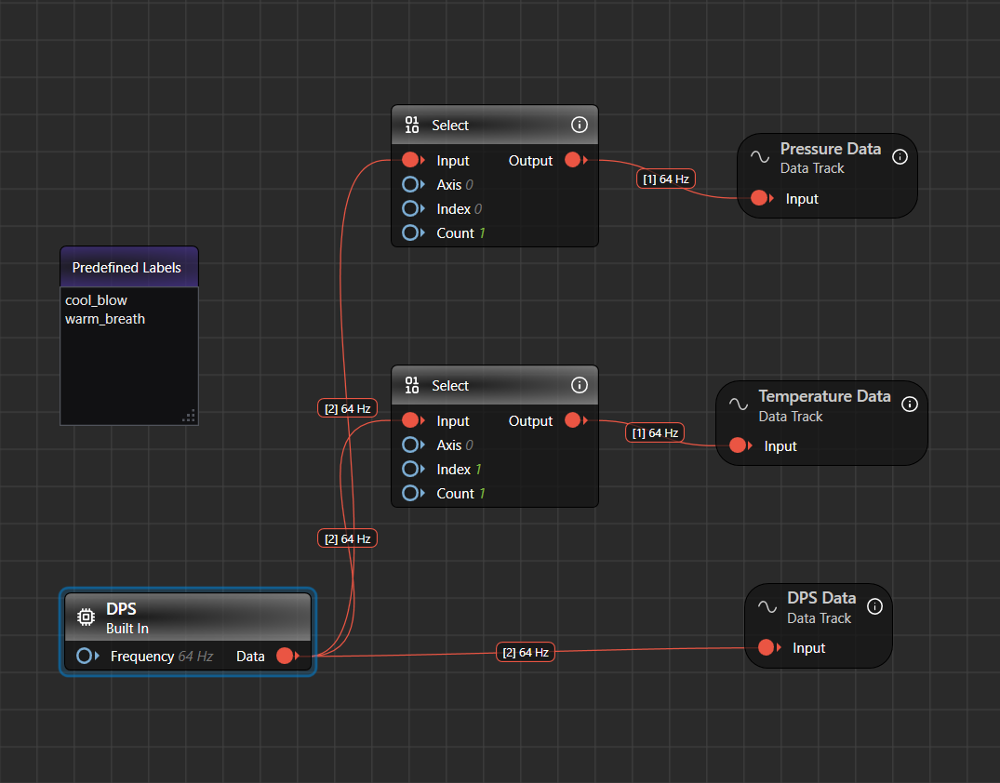
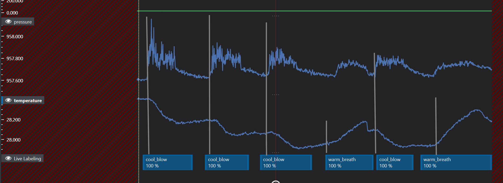

# Live Data Collection

## Overview

This GraphUX project shows you how to collect and annotate data live from external edge devices attached over USB-serial.

It is part of the Human Breath Detection Accelerator. For use-case context, sensor setup, and tips on demonstrating each breath class, see the [main README](../../README.md).

Open `Tools/LiveDataCollection/Main.imunit` from DEEPCRAFT™ Studio (double-click the file in the project tree).

The graph in Main.imunit contains input/data source nodes representing the PSoC's DPS sensor.

## Collecting and expanding the dataset

To add more data, you need to flash and configure the [DEEPCRAFT™ Streaming Protocol Firmware](https://github.com/Infineon/mtb-example-ml-deepcraft-streaming-protocol/blob/master/README.md) on your AI Kit.
Follow the instructions in the README.md file of the ModusToolbox project to correctly configure and flash the board.

Make sure you have correctly connected the PSoC 6 AI Kit to your machine via the USB connector (use J2 for streaming).

In GraphUX, you should now see a simple pipeline. The data stream of the built-in DPS, containing temperature and pressure data, is divided into two separate streams for individual visualization of pressure and temperature.

Click the white play/start button on the toolbar to execute the GraphUX pipeline. The live.imsession window will now open.
Then click the white circle to start recording. You will now see the XENSIV digital barometric pressure sensor (DPS) data: temperature (single) and pressure (single).

By clicking the "Record" button in the .imsession window, you should be able to record and visualize XENSIV digital barometric pressure sensor (DPS) data:

If needed, you can use the predefined "cool_blow" and "warm_breath" labels to annotate the collected data. For class definitions, see [A note on data labeling / model output](../../README.md#a-note-on-data-labeling--model-output) in the main README.

Once you have completed data collection, you can save the sample in the `Data` folder or your preferred folder.

**Important**: Save only the combined data streams (DPS-Data.data). Models process two data streams at the same time. Data streams are split with "Select" nodes in this project only for visualization purposes.