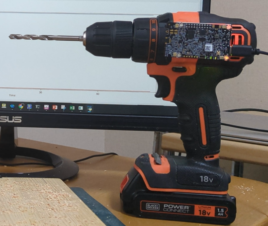
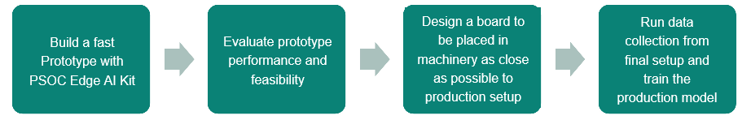

# Drill Material Detection w/ Sensor Fusion

This project is designed to work exclusively with DEEPCRAFT™ Studio. Download it from [here](https://softwaretools.infineon.com/assets/com.ifx.tb.tool.deepcraftstudio)

## Overview

This Studio Accelerator aims to provide general guidance on developing systems that detect machine operating conditions based on sound and vibration measurements via sensor fusion. 
While this project monitors a simple hand drill, the same concepts and workflow can be easily applied to any other machine, industrial or consumer. Furthermore, similar techniques and models could be used in other use-cases such as monitoring the condition of an industrial environment based on the microphone and vibration outputs.

This project sets up a classification project: a type of supervised learning where the model learns to classify data into a discrete number of classes. This project uses three classes: the material the drill is drilling into—wood, plastic, or air (when the drill is idling). 
To build a robust classifier, you need to provide data on the drill drilling each of the three classes of materials.

### How can I know if this project fits my use case?

You can use this Studio Accelerator if:

- You need to monitor machinery where operational status can be inferred from sound and vibration;
- You have an environment capable of collecting operational data for each defined class.

If you don't have the possibility of collecting a sufficient amount of operational data from your machine, this approach might not provide accurate results.

### How can this project ease my go-to-production journey?

This project demonstrates how to approach classification-based sound and vibration monitoring of a machine. If you start from this, you will have:

- A ready framework for performing sound and vibration classification
- Preprocessor and data windowing are already set
- Scripts for data collection
- Already generated model architectures for this task

## Contents

`Data` - Folder to put your data.
 
`Models` - Folder where trained models, their predictions, and generated Edge code are saved.

`Tools`    - Folder with the Data Collection GraphUX project you can use for collecting more data and a ModusToolbox project for deploying the model.

## Sensor settings specification

This Studio Accelerator requires the [PSOC™ Edge E84 AI Evaluation Kit](https://www.infineon.com/evaluation-board/kit-pse84-ai). This platform is equipped with PSOC™ Edge E84, MEMS Microphone and IMU sensors. The board is designed for easy prototyping and lets you collect real-life data to easily build a compelling ML product fast.

The hand drill is optional; you may want to collect data directly from your machinery instead. However, if you want to replicate the project out-of-the-box with a hand drill, any product similar to the one shown will be suitable. Mount the PSOC™ Edge AI Evaluation Kit equipped with MEMS Microphone and IMU sensors onto a hand drill, with the microphone's pickup section facing the drill bit - see image below.

## Collection of Data
Details on Data Collection and Preprocessing Generation can be found in the README of Tools/DataCollection

## Steps to Production

To bring this project to a production-level system, follow these general steps:

The prototyping part is fundamental since it will allow you to state the feasibility of your task in a cheap and fast way. 
If you can get to a model able to reach satisfactory performance with a simple prototype (an example Mount the PSOC™ Edge AI Kit externally on the monitored machine for small-scale data collection), then you can be pretty confident that you'll be able to get a good result in production.

More in detail, the steps to be followed could look like this:

**1. Identify the machinery or component whose behavior you want to monitor**
   
Verify that data for each class can be obtained when the machine is operated and classification is performed. 
If the material being drilled is classified into three classes—wood, plastic, and air (when the drill is idling)—confirm that data for these classes can be obtained.

**2. Collect data for a prototype application**
   
Use the GraphUX project to collect representative amounts of data. 
For each class you classify, start with at least **40 minutes of data** and test system performance directly within Studio. 
If performance is deemed insufficient, increase the data and strive to include all possible states. 
If you do not wish to retain the template data in this repository, create a new folder to store your data. Label the data you save.

**3. Import your data and train the prototype model**

Import the data you collected in the "Data" tab of the .improj file in DEEPCRAFT™ Studio.
This enables model training following DEEPCRAFT™ Studio's standard procedure. 
The `Models` folder contains several models defined for guaranteed real-time performance on the PSOC™ Edge AI Kit.

  **4. Deploy and do a real-time test of your prototype model**

  Last thing to be done in prototyping phase is to deploy the firmware to the device by leveraging the deployment project in the `Tools` folder and test the firmware on the machinery. The UART terminal will show you real-time predictions on machine behavior.

**Note**: For details on preprocessor code generation, please refer to the “Generation of preprocessing code” section in the GraphUX project's [README.md](./Units/README.md) file.

  **5. Going to the production board system**

Last step is to move to the actual final production setup. The production system will likely have the MCU placed on a board inside the machine,  the MEMS Microphone and the IMU sensor in a specific position, not necessary the same one of the prototyping phase. If you can go as close as possible to production conditions during prototyping phase, you will be able to deliver the same model also on the production board with little-to-no additional training or data needed. If this is not the case, you might need to do a new data collection step to allow the model to learn the nuances of the final setup. Follow again steps 2, 3 and 4 also for the production setup to reach a functioning application.

You may also leverage DEEPCRAFT™ Studio's Transfer Learning features for fine-tuning the prototype model to production data. This could lead to better results and faster go-to-production times, but the usage of Transfer Learning is recommended only to experienced ML users.

**Note:** All subsequent ML system lifetime monitoring procedures must be defined and implemented by you according to you needs, requirements and targets.

## Getting Started

Please visit [developer.imagimob.com](https://developer.imagimob.com), where you can read about DEEPCRAFT™ Studio and go through step-by-step tutorials to get you quickly started.

## Help & Support

If you need support or if you want to know how to deploy the model on to the device, please submit a ticket on the Infineon [community forum ](https://community.infineon.com/t5/Imagimob/bd-p/Imagimob/page/1) DEEPCRAFT™ Studio page.
