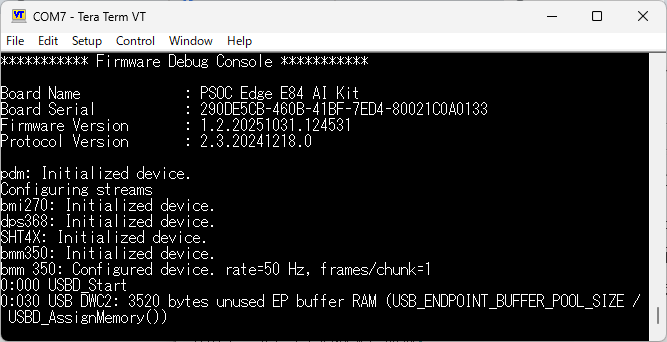
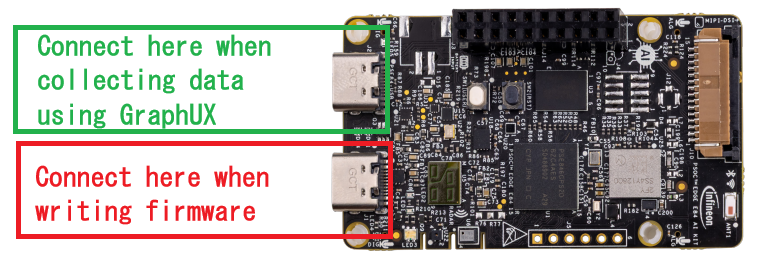
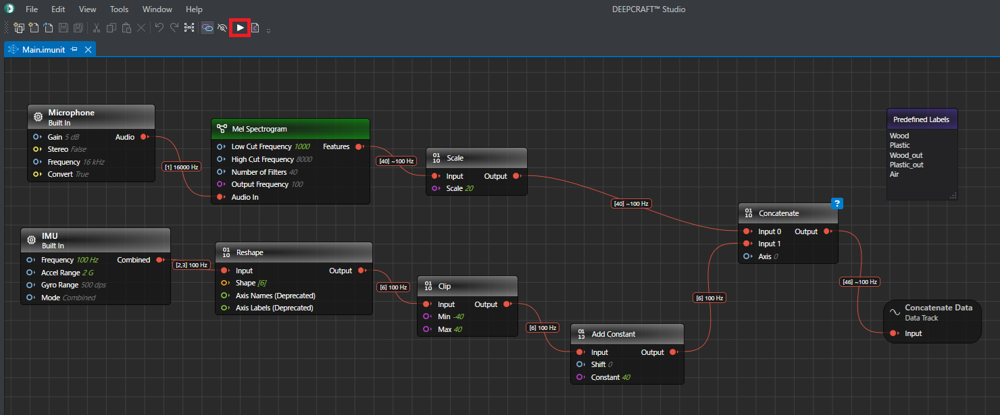
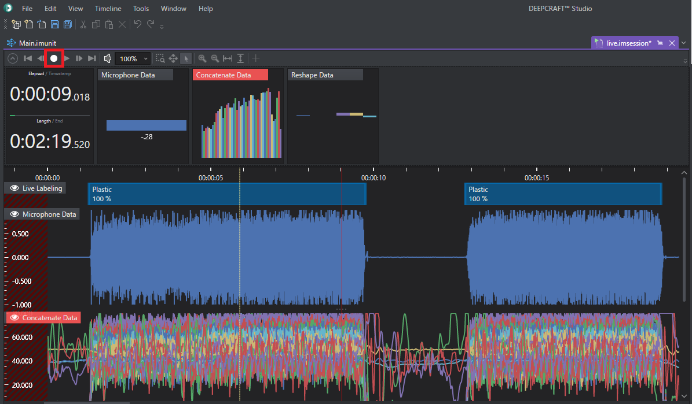
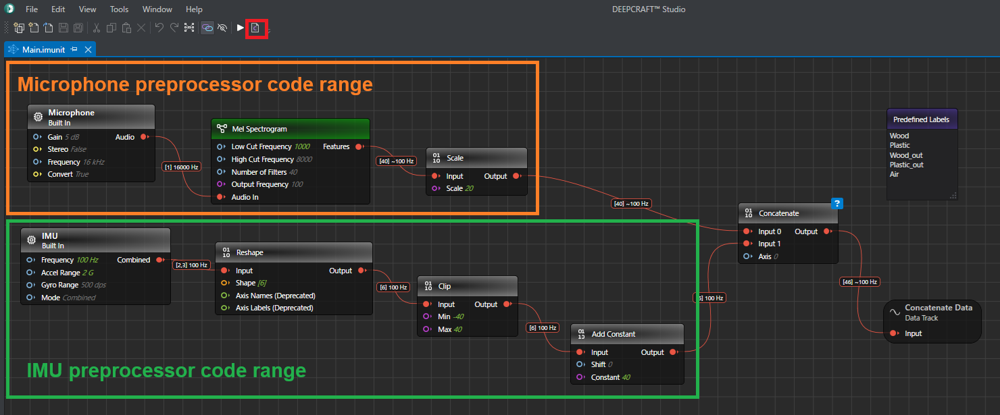
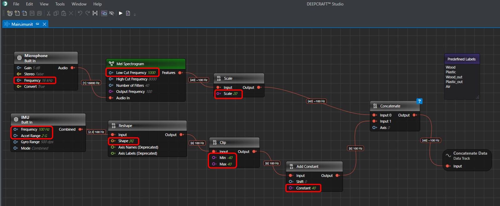
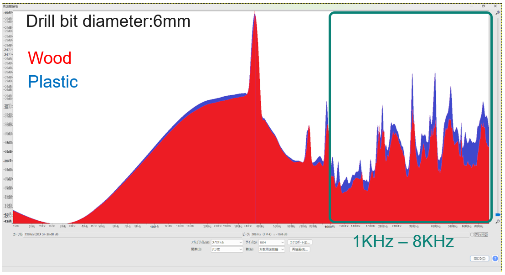
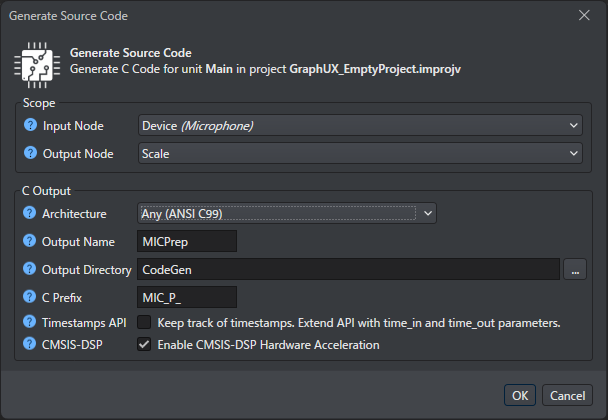
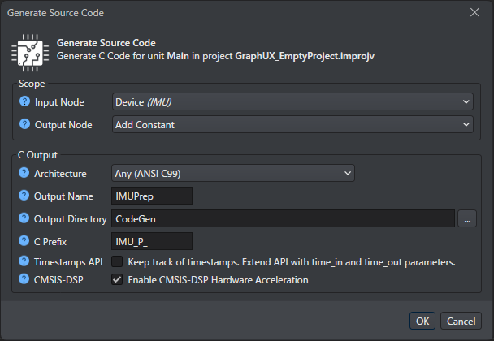

# Live Data Collection

## Overview

This project shows you how to collect and annotate IMU+Microphone sensor fusion data live. This can be done directly from your PSOC™ Edge E84 AI Evaluation Kit attached over USB-serial. It requires running the 'PSOC Edge DEEPCRAFT Machine Learning Data Collection' firmware on your device, found in ModusToolbox and the [documentation](https://developer.imagimob.com/deepcraft-studio/getting-started/infineon-boards/psoc-edge-e84-eval-kit).

The graph that you see in the Main.imunit contains input/data source nodes representing the device connected through the serial port.

## Collecting and expanding the dataset

To add more data, you need to flash and configure the [PSOC™ Edge MCU: Machine Learning - DEEPCRAFT™ data collection (DEEPCRAFT™ streaming protocol v2) firmware](https://github.com/Infineon/mtb-example-psoc-edge-ml-deepcraft-data-collection/blob/master/README.md) on your AI Kit.
Follow the instructions in the [README.md](https://github.com/Infineon/mtb-example-psoc-edge-ml-deepcraft-data-collection/blob/master/README.md) file of the ModusToolbox project to correctly configure and flash the board.

After writing the firmware, verify that the “Firmware Debug Console” appears in the UART terminal. Then, connect the USB cable to a different connector than the one used when writing the firmware to the PSOC™ Edge AI Kit, see image below.

For starting data collection, navigate to the `Tools` folder and double-click the `Main.imunit` file.

Click the "Start" button on the toolbar to execute the GraphUX pipeline.
By clicking the "Record" button in the .imsession window, you should be able to record data:

Once you have completed data collection, you can save the sample in the `Data` folder or your preferred folder.

### Data format modification
Data collected by GraphUX is saved in the format of “preprocessed data” that is input into the learning model.
However, when collecting data from multiple sensors (Sensor Fusion), the saved data includes a “Length” column, which must be removed before inputting it into the learning model.

## Generation of preprocessing code
When deploying a trained model to an MCU, you must deploy the preprocessing alongside the model.
The preprocessing is defined as a graph within this data collection project, and code can be generated from the graph. However, when using multiple sensors (sensor fusion), data synchronization between sensors is required. Currently, DEEPCRAFT™ Studio cannot generate code for the synchronization portion from the graph. Therefore, when deploying to the MCU, you must generate separate preprocessing code for each sensor and manually implement the synchronization logic within the MCU-side project.
This section explains how to generate separate preprocessing code for each sensor.
For the synchronization logic, refer to the MCU-side project.

### Data Preprocessing Overview

This graph shows the preprocessing applied to MEMS microphone and IMU data during model training and inference, converting it into a format suitable for model input.

MEMS Microphone data is sampled at 16 kHz. Preprocessing involves passing frequencies between 1 kHz and 8 kHz through a BPF in the Mel Spectrogram node, then converting the data into a 40-element first-order tensor using a Mel Filter Band, and finally scaling it by a factor of 20 in the Scale node.
The BPF cuts frequencies below 1 kHz because the spectral differences between drilling into wood and plastic are most pronounced between 1 kHz and 8 kHz.

IMU data is sampled at 100Hz. Preprocessing involves converting the data from a 2×3 second-order tensor to a first-order tensor with 6 elements using the Reshape node, followed by saturation processing between -40 and 40 using the Clip node. This is done to saturate data variations caused by movement, since the acceleration and angular velocity of the drill itself during movement are significantly larger than the vibrations of the drill during drilling. Next, the Add Constant node adds 40 to offset the data range between 0 and 80.

The preprocessed MEMS microphone and IMU data are combined in the Concatenate node and stored in the output data track node.

### Generation of Preprocessing Code for MEMS Microphones

**1. Click the “Generate Source Code” button to the right of the “Start” button on the toolbar.**

**2. The “Generate Source Code” dialog will appear. Configure it as follows.**

**3. Click “OK”.**

### Generation of Preprocessing Code for IMU

**1. Click the “Generate Source Code” button to the right of the “Start” button on the toolbar.**

**2. The “Generate Source Code” dialog will appear. Configure it as follows.**

**3. Click “OK”.**

## Getting Started

Please visit [developer.imagimob.com](https://developer.imagimob.com), where you can read about DEEPCRAFT™ Studio and go through step-by-step tutorials to get you quickly started.

## Help & Support

If you need support or if you want to know how to deploy the model on to the device, please submit a ticket on the Infineon [community forum ](https://community.infineon.com/t5/Imagimob/bd-p/Imagimob/page/1) DEEPCRAFT™ Studio page.
