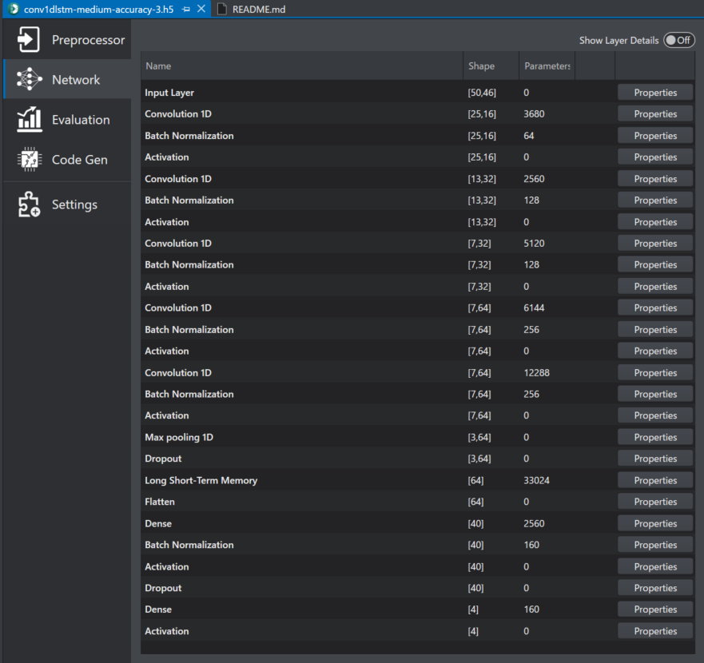
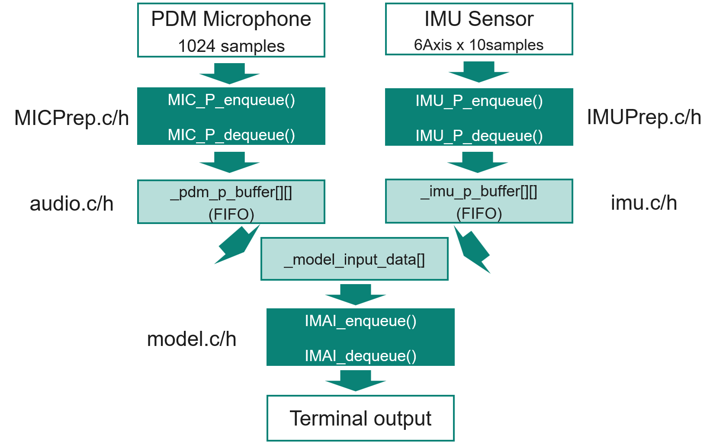

[Click here](../README.md) to view the README.

## Design and implementation

The design of this application is minimalistic to get started with code examples on PSOC&trade; Edge MCU devices. All PSOC&trade; Edge E84 MCU applications have a dual-CPU three-project structure to develop code for the CM33 and CM55 cores. The CM33 core has two separate projects for the secure processing environment (SPE) and non-secure processing environment (NSPE). A project folder consists of various subfolders, each denoting a specific aspect of the project. The three project folders are as follows:

**Table 1. Application projects**

Project | Description
--------|------------------------
*proj_cm33_s* | Project for CM33 secure processing environment (SPE)
*proj_cm33_ns* | Project for CM33 non-secure processing environment (NSPE)
*proj_cm55* | CM55 project

 

### Drill Material Detection (Sensor Fusion)

This example includes drill material detection model that works out-of-box without requiring any changes.

This model is based on the �gDrill Material Detection (Sensor Fusion)�h starter project from the DEEPCRAFT&trade; Studio. It processes audio data from a pulse density modulation (PDM) microphone and vibration data from an IMU sensor to detect the material being drilled.

DEEPCRAFT&trade; Studio generates the code files (*MICPrep.c/h* and *IMUPrep.c/h*) required for processing data before feeding it to ML models, as well as the code files (*model.c/h*) required for model inference.

Input data processes audio data from the PDM microphone and vibration data from the IMU sensor separately.

Data from the PDM microphone is converted to PCM using the embedded PDM/PCM converter block. The received PCM data has a sampling rate of 16kHz. After receiving 1024 samples, it is supplied to the audio preprocessing code generated by DEEPCRAFT&trade; Studio using the `MIC_P_enqueue` API. Once the data required for preprocessing is complete, the preprocessed data is retrieved using the `MIC_P_dequeue` API and stored in the `_pdm_p_buffer`.

Vibration data from the IMU sensor (3-axis (x, y, z) acceleration and angular velocity) is similarly supplied to the vibration preprocessing code generated by DEEPCRAFT&trade; Studio using the `IMU_P_enqueue` API. Once the data required for preprocessing is complete, the preprocessed data is retrieved using the `IMU_P_dequeue` API and stored in the `_imu_p_buffer`.

When preprocessed data is stored in both the `_pdm_p_buffer` and `_imu_p_buffer`, they are combined and fed into the model inference code generated by DEEPCRAFT&trade; Studio using the `IMAI_enqueue` API. After processing completes, the `IMAI_dequeue` API returns results in score format corresponding to each label. All label scores, including the label corresponding to the maximum score exceeding the threshold, are output to the UART terminal.

The preprocessing layers for drill material detection defined and code-generated in GraphUX of DEEPCRAFT&trade; Studio is shown in **Figure 1**.

**Figure 1. Drill material detection pre-processing layers**

The drill material detection model is a 1D convolutional neural net that contains the layers, as shown in **Figure 2**.

**Figure 2. Drill material detection model layers**

The overall data flow for drill material detection as shown in **Figure 3**.

**Figure 3. Drill Material Detection Data Flow**

### Memory placement of model and arena data

On CM33 + NNLite, it is recommended to place the model weights and arena data in the SRAM for best performance. Place the model weights by defining the `CY_ML_MODEL_MEM` macro to the desired memory section from the CM33 NS linker script. For the arena data, use the `CY_ML_ARENA_MEM` macro. 

In this code example, the `CY_ML_MODEL_MEM` macro is set to the `.cy_sram_code` section using the CM33 project *Makefile*, ensuring the model data is placed in SRAM for optimal performance. The `CY_ML_ARENA_MEM` macro is not defined in this example so the arena buffer gets placed in the default data segment. 

> **Note:** The memory section to which the macros are assigned must be defined in the CM33 NS linker script.

On CM55 + U55, it is recommended to place the model weights in the system SRAM (SoCMEM) for best performance while the arena data must be placed in the system SRAM (SoCMEM) for the proper functioning of the application. Configure the model data placement using the `CY_ML_MODEL_MEM` macro and the arena data using the `CY_ML_ARENA_MEM` macro. 

In this code example, both `CY_ML_MODEL_MEM` and `CY_ML_ARENA_MEM` macros are set to the `.cy_socmem_data` section using the CM55 project Makefile, ensuring the model and arena data are placed in the System SRAM (SoCMEM) for optimal performance. 

> **Note:** The memory section to which the macros are assigned must be defined in the CM55 linker script.

### Generating the model

This code example ships with the drill material detection files (*model.c/h*, *MICPrep.c/h*, *IMUPrep.c/h*) produced by DEEPCRAFT&trade; Studio. Use DEEPCRAFT&trade; Studio to capture the new data and review, modify, or generate new models for evaluation. For more information, see [Deploy model on PSOC&trade; 6 and PSOC&trade; Edge boards](https://developer.imagimob.com/deepcraft-studio/deployment/deploy-models-supported-boards/deploy-model-PSOC-6-PSOC-Edge). For details on generating, optimizing, and validating the model code using DEEPCRAFT&trade; Studio, see [Code generation for Infineon boards](https://developer.imagimob.com/deepcraft-studio/code-generation/code-gen-infineon-boards).

### Running the generated model

1. Generate the model files as described in [Generating the model](#generating-the-model).

2. Open the *common.mk* file and set `ML_DEEPCRAFT_CPU` to 'cm55' or 'cm33'.

3. Open the *proj_cmxx/Makefile* file and set `NN_TYPE` to 'int8x8' or 'float' to select the desired quantization based on the generated model.

4. Program the device as described in the [Operation](../README.md#operation) Section.

 