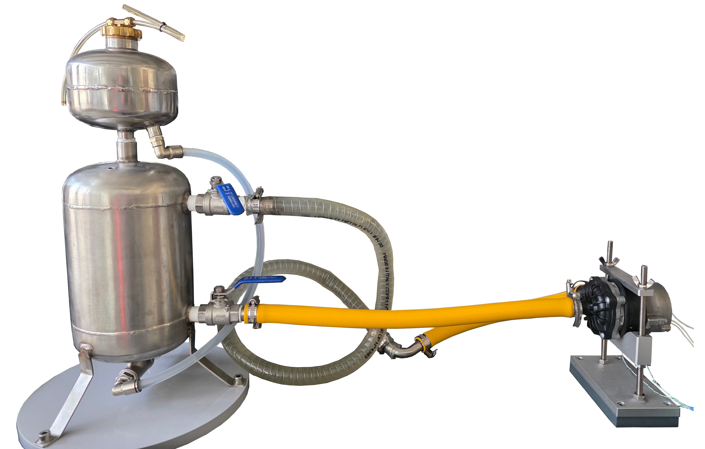
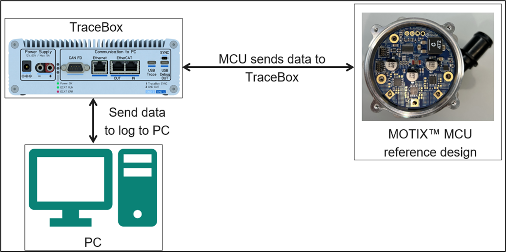

# Virtual Motor Winding Temperature Estimation
This project is designed to work exclusively with DEEPCRAFT™ Studio. Download it from [here](https://softwaretools.infineon.com/assets/com.ifx.tb.tool.deepcraftstudio)

## Overview - Use-Case

This machine learning project enables estimation of the temperature of motor windings using machine learning methods with measured die temperature, square and sum of direct and quadrature currents, and motor speed (rpm). A 3-phase BLDC water pump motor is used in the project, however, the project could be run with any kind of 3-phase BLDC motor.

- **Problem:** Accurate real-time estimation of motor winding temperature without physical temperature sensors
- **ML Method:** Neural network regression model 
- **Sensor & Data:** TLE995x motor controller with die temperature sensor, current measurements (direct and quadrature current), and speed feedback. Data sampled at 10 Hz and downsampled to 0.1 Hz
- **Relevance:** This solution enables:
  - Optimized motor derating for specific applications
  - Efficient operation at extreme operating points
  - Cost savings by eliminating physical temperature sensors and their assembly
  - Safer motor operation with virtual temperature monitoring

## Contents

`Data` - Contains raw MATLAB measurement files (.mat) and all processed data outputs
- `measurement_data/` - Raw .mat files from TLE995x motor controller experiments
- `processed/` - Pipeline outputs including CSVs, downsampled/normalized data, and training datasets

`Models` - Folder where trained DEEPCRAFT models, predictions, and generated Edge code are saved

`Resources` - Contains project resources including connection diagrams and documentation

`Tools` - Contains data processing scripts and virtual environment
- `scripts/` - Complete data processing pipeline (MATLAB conversion, downsampling, normalization, splitting)

## Sensor(s) & Data

### Hardware Setup

- **Target Motor:** [Pierburg CWA150](https://www.tecomotive.com/en/products/CWA150.html) water pump motor
- **Power Supply:** 12V
- **Motor Controller:** [REF_WATERPUMP150W](https://www.infineon.com/evaluation-board/REF-WATERPUMP150W) evaluation board with TLE995x. The firmware could be requested via Infineon Developer Center
- **Temperature Sensors:**
  - Die temperature sensor (embedded in TLE995x) - Input feature
  - Coil temperature sensor - Any K-type thermocouple to measure the target motor winding temperature (ground truth), for example RS219/1016
- **Data Acquisition:** [TraceBox](https://www.moteon.com/tracebox.html) measurement device

### Data Specifications

The dataset consists of multiple measurement sessions collected from TLE995x motor controller:

**Input Features (data.csv):**
- `spi_time` - Timestamp (seconds)
- `die_temp_filtered` - Filtered die temperature (°C) from internal temperature sensor to remove any noise caused by ADC measurement. Built-in ADC filters are used to acquire the average die temperature measurements.
- `dqCommand_combined` - Magnitude of the current flowing through the motor
  - Direct and quadrature currents are measured from the field-oriented control (FOC) algorithm operating the 3-phase BLDC motor. Direct and quadrature currents are squared and added to achieve: imag² + real² = `dqCommand_combined`
- `outputSpeed_rpm` - Motor output speed (RPM)

**Target Variable (label.csv):**
- `spi_time` - Timestamp (seconds)
- `coil_temp_filtered` - Filtered coil temperature (°C) - ground truth

**Sampling:**
- Original sampling rate: 10 Hz
- Processed sampling rate: 0.1 Hz (10-second intervals)
- Data reduction: ~99%

**Data Processing:**
- Downsampling from 10 Hz to 0.1 Hz with uniform time intervals
- Min-Max normalization to [0, 1] range (excludes spi_time)
- Scaler objects saved for inverse transformation
- Data split into training parts for batch processing

**Files:**
- 4 measurement sessions (.mat files)
- Multiple training/validation sets ready for DEEPCRAFT™ Studio
- Format: CSV files with data.csv (inputs) and label.csv (targets) pairs

### Physical Installation

1. Connect REF_WATERPUMP150W board to 12V power supply
2. Connect board to Pierburg CWA150 water pump motor connected to a water cycle
3. Mount physical coil temperature sensor on motor windings
4. Connect TraceBox to board for data measurement
5. Configure TraceBox for continuous data logging

---
Physical setup with water pump and water tank

---
Temperature sensor installation at the motor windings

---
Data logging setup

---

## Adding More Data

### Data Collection Process

To expand the dataset with new measurements:

1. **Hardware Setup**
   - Follow physical installation steps above
   - Ensure all sensors are properly connected and calibrated
   - Verify TraceBox connection and sampling rate (10 Hz)

2. **Running Experiments**
   - Design test scenarios covering different operating conditions:
     - Various motor speeds (RPM ranges)
     - Different load profiles (power levels)
     - Multiple ambient temperatures
     - Preheated vs. cold start conditions
   - Record data using TraceBox and save as .mat files
   - Place .mat files in `Data/measurement_data/` folder

3. **Data Processing Pipeline**
   
   To run the automated processing scripts, see [Tools/README.md](Tools/README.md) for more details.

4. **Data Labeling**
   - Physical coil temperature sensor provides ground truth labels automatically
   - No manual labeling required - sensor measurements are saved in .mat files
   - Automated script (`3_separate_input_data_target_data.py`) separates inputs from target labels
   - Each dataset is automatically organized into `data.csv` and `label.csv` files

5. **Dataset Organization**
   - Processed data is automatically organized in `Data/processed/` subfolders
   - Ready for import into DEEPCRAFT™ Studio
   - Training/validation split can be configured in Studio

### Important Measurement Scenarios

To ensure robust model performance, collect data covering:
- Different motor speeds: 0-6000 RPM range
- Variable loads: 0-150W power levels
- Temperature ranges: 20-100°C operating conditions
- Transient conditions: startup, shutdown, load changes
- Steady-state operation at various setpoints

## Steps to Production

### 1. Increase Data Variability

**Current Status:** Dataset includes 4 measurement sessions with various operating conditions.

**To Improve:**
- Collect data from **multiple motor units** to account for device-to-device variations
- Test under **different ambient temperatures** (cold, room temperature, hot environments)
- Include **various mounting configurations** and thermal conditions
- Record data across **full motor lifecycle** (new motor vs. aged motor)
- Add measurements from **different application scenarios** (continuous operation, intermittent use, high-duty cycles)

**DEEPCRAFT™ Studio Features:**
- Use Data Augmentation capabilities if applicable to sensor data
- Leverage Studio to visualize multiple datasets

### 2. Robust Train/Test Split

**Current Approach:** Data is split into multiple parts for training.

**Production Requirements:**
- Ensure **Test set** contains data from:
  - Different measurement sessions than Train/Validation sets
  - Different motors (if available)
  - Operating conditions not seen during training
  - Edge cases and extreme conditions
- Verify model **generalizes** across:
  - Different RPM ranges
  - Various load profiles
  - Temperature transitions

### 3. Increase Model Robustness

**Add Negative/Edge Cases:**
- Motor fault conditions (if safe to measure)
- Sensor noise scenarios
- Rapid temperature changes
- Operation outside normal specifications
- Invalid sensor readings (for error detection)

**Validation Strategy:**
- Test model predictions against physical sensor for extended periods
- Measure prediction accuracy drift over time
- Validate across different motor operating points
- Compare against physics-based thermal models

### 4. Model Optimization for Edge Deployment

**Considerations:**
- Target platform: TLE995x or companion microcontroller
- Memory constraints: Optimize model size for embedded deployment
- Inference speed: Real-time temperature estimation (0.1 Hz or faster)
- Power consumption: Efficient neural network inference

### 5. Safety and Validation

**Critical for Production:**
- Define safety thresholds and fail-safe mechanisms
- Implement watchdog for model health monitoring
- Add fallback to conservative protection if model fails
- Validate against physical sensor during commissioning
- Define update strategy for model improvements
---

